# USB Android Virtual Touchpad

[](LICENSE)
[](#requirements)
[](https://adoptium.net/)
[](#building-from-source)
[](#network-architecture)

Transform any Android smartphone into a ultra-low-latency, high-precision physical USB touchpad for Windows. Communication runs over a local TCP socket tunneled directly through an Android Debug Bridge (ADB) reverse connection, completely bypassing Wi-Fi jitter, Bluetooth pairing issues, root requirements, and external cloud dependencies.

---

## Table of Contents

- [Overview](#overview)
- [Key Features](#key-features)
- [Network Architecture](#network-architecture)
- [Quick Start Guide](#quick-start-guide)
- [Prerequisites](#prerequisites)
- [Gesture and Control Reference](#gesture-and-control-reference)
- [Building from Source](#building-from-source)
- [Performance Engineering](#performance-engineering)
- [Troubleshooting Matrix](#troubleshooting-matrix)
- [Project Directory Structure](#project-directory-structure)
- [Open Source Contributing](#open-source-contributing)
- [License](#license)

---

## Overview

Laptop trackpads are often small, fixed in position, and inconvenient during desktop setups. Standard wireless mouse apps introduce noticeable input lag due to Wi-Fi packet drops, Bluetooth polling overhead, and routing contention.

This project delivers physical mouse responsiveness by combining:
1. Direct USB transmission via ADB reverse forwarding.
2. Custom binary framing with TCP socket tuning (`TCP_NODELAY`, high-priority traffic class).
3. Physics-based pointer ballistics and Bresenham sub-pixel delta accumulation.
4. Native Windows cursor control via Java Robot with multi-monitor boundary resolution.

---

## Key Features

- **Direct USB Link**: Zero Wi-Fi dependence. Packets travel straight through the USB cable.
- **Dynamic Pointer Ballistics**: Non-linear acceleration curve dynamically adjusts gain based on finger velocity. Slow movements enable pixel-perfect targeting, while rapid flicks traverse multi-monitor setups effortlessly.
- **Sub-Pixel Bresenham Accumulator**: Micro-movements and fractional movement deltas are accumulated rather than truncated to zero.
- **Jitter Deadband Filtering**: Eliminates sensor micro-noise when resting a finger motionless on the glass.
- **Physical Mouse Hardware Buttons**: Dedicated on-screen Left Click, Right Click, and Middle Click buttons with tactile 20ms haptic vibration.
- **Tap-to-Drag Support**: Tap once, touch down again, and drag to highlight text or drag windows without requiring separate button holds.
- **Calibrated Two-Finger Scrolling**: Smooth, normalized scrolling with discrete 10px accumulation steps.
- **Auto-Connect and Reconnect**: Client automatically establishes connection to `127.0.0.1:5000` on startup and seamlessly recovers if paused.
- **Display Wake Lock**: Prevents phone display from sleeping while actively using the touchpad surface.

---

## Network Architecture

```mermaid
flowchart LR
    subgraph AndroidDevice ["Android Client"]
        A[Touchscreen Surface] --> B[Gesture Handler]
        B --> C[Packet Encoder]
        C --> D[Outgoing Packet Queue]
        D --> E[TCP Client Socket]
    end

    subgraph USBTunnel ["Physical USB Pipeline"]
        E -->|Localhost 127.0.0.1:5000| F[ADB Reverse Tunnel]
        F -->|USB Cable| G[PC Port 5000]
    end

    subgraph WindowsHost ["Windows Server"]
        G --> H[Touchpad Server]
        H --> I[Packet Decoder]
        I --> J[Mouse Controller]
        J --> K[Java Robot API]
        K --> L[Windows OS Cursor]
    end
```



### Packet Framing

The wire protocol uses compact, fixed-size binary frames to guarantee zero serialization overhead:

```
+---------------+---------------+--------------------+
| Type (1 Byte) | Length (2 B)  |  Payload (N Bytes) |
+---------------+---------------+--------------------+
```

- **Type `0x01` (MOVE)**: 4-byte payload containing signed 16-bit integers (`dx`, `dy`).
- **Type `0x02` (LEFT_CLICK)**: 0-byte payload.
- **Type `0x03` (RIGHT_CLICK)**: 0-byte payload.
- **Type `0x04` (DOUBLE_CLICK)**: 0-byte payload.
- **Type `0x05` (SCROLL)**: 2-byte signed integer vertical step count.
- **Type `0x06` (HORIZONTAL_SCROLL)**: 2-byte signed integer horizontal step count.
- **Type `0x07` (LEFT_DOWN)**: 0-byte payload (initiates click-drag).
- **Type `0x08` (LEFT_UP)**: 0-byte payload (concludes click-drag).
- **Type `0x09` (PING) / `0x0A` (PONG)**: Heartbeat verification.
- **Type `0x0A` (MIDDLE_CLICK)**: 0-byte payload.
- **Type `0x0B` (RIGHT_DOWN)** / **Type `0x0C` (RIGHT_UP)**: 0-byte payloads.

---

## Quick Start Guide

### Step 1: Connect Phone via USB
1. Plug your Android phone into your Windows PC using a standard USB cable.
2. Ensure **USB Debugging** is turned on in your phone's Developer Options.
3. If prompted on the phone, select **Allow USB debugging** (check "Always allow from this computer").

### Step 2: Start the Server
Navigate to the `scripts` folder and execute the one-step runner:

```bat
scripts\run-usb.bat
```

This automated script will:
- Automatically locate `adb.exe` on your system.
- Establish the ADB reverse port forward (`tcp:5000 tcp:5000`).
- Launch the Windows Desktop Touchpad Server in an active console window.

### Step 3: Open the Android App
Launch **Wireless Touchpad & Mouse** on your phone.
- The app automatically connects to `127.0.0.1:5000` on launch.
- The status header displays **Connected** in green.
- Your phone screen is now an active touchpad for your PC.

---

## Prerequisites

### 1. Windows Host Machine
- **Operating System**: Windows 10 or Windows 11 (64-bit).
- **Java Runtime**: OpenJDK 17 or newer. Verify by running:
  ```bat
  java -version
  ```
- **Android Platform Tools (ADB)**:
  Typically located at `%LOCALAPPDATA%\Android\Sdk\platform-tools\adb.exe` or installed via standalone tools. The included scripts automatically scan your default Android SDK locations.

### 2. Android Device
- Android 8.0 (Oreo) or newer.
- USB Debugging enabled:
  1. Go to **Settings** > **About Phone**.
  2. Tap **Build Number** 7 times until Developer Mode is unlocked.
  3. Navigate to **Settings** > **System** (or Additional Settings) > **Developer Options**.
  4. Enable **USB Debugging**.

---

## Gesture and Control Reference

| Gesture / Input | Action Triggered | Behavior Description |
|---|---|---|
| **Single Finger Slide** | Move Cursor | High-rate relative delta with dynamic acceleration curve |
| **Single Tap** | Left Click | Discrete click event sent on finger release within tap slop |
| **Double Tap** | Double Click | Two rapid left click events |
| **Tap + Hold + Drag** | Drag Selection | Tap once, hold down immediately, and drag to highlight or move |
| **Long Press (450ms)** | Left Mouse Down | Enters dragging mode directly without lifting finger |
| **Two Finger Slide** | Scroll Wheel | Smooth vertical and horizontal scrolling |
| **Two Finger Tap** | Right Click | Discrete context menu click |
| **Three Finger Tap** | Middle Click | Middle mouse button click (e.g. open links in background tab) |
| **Left Click Button** | Physical Left Button | Dedicated hardware-style button with touch-down / touch-up tracking |
| **Mid Button** | Physical Middle Button | Discrete middle mouse click with haptic response |
| **Right Click Button** | Physical Right Button | Discrete right mouse click with haptic response |
| **Sensitivity Slider** | Speed Adjustment | Dynamically alters sensitivity gain from 0.2x up to 3.0x |

---

## Building from Source

### Building the Desktop Server

#### Method A: Independent Script Build (No Gradle Required)
The project includes a standalone compilation toolchain that builds directly using the system Java compiler:

```powershell
powershell -ExecutionPolicy Bypass -File scripts\compile-and-test.ps1
```

This compiles `touchpad-protocol`, `desktop-server`, executes the full JUnit test suite, and outputs:
```
desktop-server\build\libs\desktop-server-1.0.0-all.jar
```

#### Method B: Gradle Build
From the repository root:

```bat
gradlew.bat :desktop-server:shadowJar
```

---

### Building and Installing the Android Client

#### Build the Debug APK:
```bat
cd android-client
gradlew.bat assembleDebug
```

The compiled APK will be generated at:
```
android-client\app\build\outputs\apk\debug\app-debug.apk
```

#### Direct Installation via ADB:
From the project root:
```bat
adb install -r android-client\app\build\outputs\apk\debug\app-debug.apk
```

---

## Performance Engineering

### 1. Pointer Ballistics Model
Raw touch deltas do not match human hand ergonomics. The project applies dynamic velocity curves calculated per event time interval `dt`:

$$\text{Speed} = \frac{\sqrt{\Delta x^2 + \Delta y^2}}{\Delta t}$$

- **Precision Band** ($\text{Speed} < 0.2\text{ px/ms}$): Gain scaling of $0.90\times$ for steady single-pixel alignment.
- **Linear Band** ($0.2 \le \text{Speed} < 1.0\text{ px/ms}$): Smooth interpolated progression.
- **Ballistic Boost** ($\text{Speed} \ge 1.0\text{ px/ms}$): Exponential acceleration up to $3.5\times$ for swift long-range navigation.

### 2. Sub-Pixel Bresenham Accumulation
Dividing or scaling fractional floating-point pixel deltas often truncates remainder decimals to zero, causing micro-movements to feel stuck or jittery. A fractional accumulator retains fractional remainders across successive frames:

```java
subpixelX += scaledDx;
int sendDx = Math.round(subpixelX);
subpixelX -= sendDx;
```

### 3. Move Coalescing Pipeline
High-frequency touch digitizers can generate over 120-240 events per second. The client-side writer thread uses a dual-queue system:
- **Critical Control Packets** (clicks, drags, scrolls) are prioritized in a discrete queue.
- **Consecutive Movement Deltas** are summed atomically into pending accumulator registers, preventing network queue congestion.

---

## Troubleshooting Matrix

| Symptom | Underlying Cause | Resolution |
|---|---|---|
| `adb: device unauthorized` | RSA key not accepted on device | Unlock phone screen and tap "Always allow from this computer" on the USB prompt. |
| `adb: no devices/emulators found` | USB cable is charge-only or USB debugging disabled | Use a verified data cable, change USB port, and ensure Developer Options > USB Debugging is ON. |
| Status shows `Disconnected` | Server is not running or tunnel broken | Run `scripts\run-usb.bat` on the PC and confirm the terminal window stays open. |
| Mouse cursor jumps to top-left corner | Outdated server binary caching system coordinate `(0,0)` | Run `powershell -ExecutionPolicy Bypass -File scripts\compile-and-test.ps1` to ensure latest `MouseController` is compiled. |
| Movement feels sluggish or too fast | Default sensitivity mismatch | Adjust the on-screen Sensitivity Slider in the app to match your screen resolution. |
| Android display dims during usage | Android display timeout reached | The latest build activates `FLAG_KEEP_SCREEN_ON`. Update to the newest APK build. |

---

## Project Directory Structure

```
CNL_Project/
|-- android-client/               # Android Native Application Module
|   |-- app/                      # Main Android application source
|   |   |-- src/main/java/        # UI Activities, Views, and Gesture Engine
|   |   `-- src/main/res/         # Vector graphics, layouts, and strings
|   `-- gradlew.bat               # Android Gradle build wrapper
|
|-- desktop-server/               # Windows Desktop Server Module
|   |-- src/main/java/            # TCP Server, Connection Handler, Mouse Robot
|   `-- src/test/java/            # Server unit and integration tests
|
|-- touchpad-protocol/            # Shared Platform-Agnostic Wire Codec
|   |-- src/main/java/            # PacketEncoder, PacketDecoder, Constants
|   `-- src/test/java/            # Round-trip binary frame tests
|
|-- scripts/                      # Automation & Deployment Utilities
|   |-- run-usb.bat               # Master one-click startup runner
|   |-- setup-adb.bat             # ADB reverse configuration utility
|   |-- start-server.bat          # Desktop server launcher
|   |-- config.bat                # Shared system paths and port configuration
|   `-- compile-and-test.ps1      # Standalone offline compiler & test suite
|
|-- PROTOCOL.md                   # Complete Binary Wire Protocol Specification
`-- README.md                     # Project documentation
```

---

## Open Source Contributing

Contributions from the developer community are welcome. To contribute:

1. **Fork the Repository**: Create your personal branch (`git checkout -b feature/performance-boost`).
2. **Adhere to Code Standards**: Ensure all unit tests pass before submitting changes:
   ```powershell
   powershell -ExecutionPolicy Bypass -File scripts\compile-and-test.ps1
   ```
3. **Commit Your Code**: Keep commit messages concise and descriptive.
4. **Submit a Pull Request**: Provide a detailed explanation of changes, test coverage, and benchmark measurements.

---

## License

This project is licensed under the **MIT License**. You are free to modify, distribute, and integrate this software in private and commercial applications. See [LICENSE](LICENSE) for full details.
